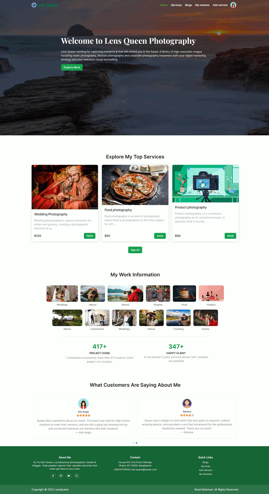

# Lens-Queen (Client)
## A Photography services website

#### Assignment 11

### Github Repo: https://github.com/rasel-mahmud-dev/lens-queen-photography-services-frontend
### Github Repo(Backend): https://github.com/rasel-mahmud-dev/lens-queen-photography-services-backend

### Live site: https://lens-queen.web.app

## Features
- Implement user friendly all form validator. 
- user can login via their google account or email & password.
- user can reset password if they forgot it.
- users/customer can see all my services that I provide.
- They can see all review that are provide review by other user for my service.
- Only logged user can give reviews for a service also.
- In /my-reviews page only logged can see own all reviews. 
- Authenticated user also can add, update, delete service.
- user see all reviews for a particular service and also only logged user can add, delete, update reviews

## Work Outline

- In top has a responsible Navigation that has some page link. And condition rendering if user logged then render auth 
 image and a dropdown that has logout add service, my reviews logout item.

- Create routing, I use react-router-dom. and create private route like add-service, my-reviews.

- Also Create non auth-visible route like login and registration. if user already logged than he can not visit login and registration page unless he logout 

- We have two authentication system email/password based and google account based.

- Homepage fetch three photography services, and has some worked projects and testimonials. all data contains in mongodb database. 
  Using Api request these data are fetched. 

- We have services route that show all my photography services, that are store in mongodb services collections. 
  and user can paginate and change per Page show data. also each service has delete and edit button, authenticate use can delete and update services. 

- In service Detail page, show all details about service and show all review descending order by create time.

- In Blogs pages has some interview question

## Technology used.

- Reactjs
- react-router-dom
- Tailwindcss
- Firebase
- react-toastify
- react-helmet
- react-spinners
- react-photo-view
- react-transition-group
- react-icons
- swiper
- axios

## Preview Photo of HomePage
